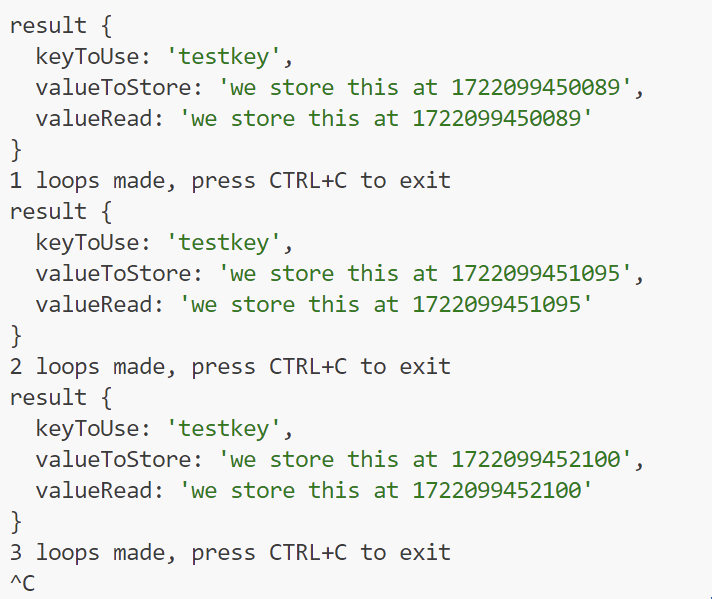

# Simple redis configuration task
## Step 1
* start a simple redis instance using the docker-compose.yml file included in this repo
* install necessary NPM modules and run src/redis.ts, which is a super simple test if the redis server is configured correctly. The result should look similar

## Step 2
You will notice that this redis installation is not failsafe, so create a docker-compose which will install and run a simple fail-safe redis installation.

Find at least two solutions how this can be done and make a list of pros and cons for each of the two methods

## Step 3
make the src/redis.ts run against the new failsafe redis installation. Test the failover. If you can't get it running explain why and what changes should be made to the file src/redis.ts to make it fault tolerant
